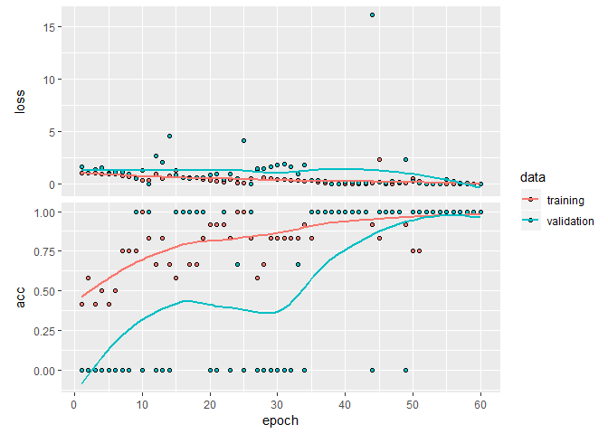

Image Recognition using Keras - Convolutional Neural Networks
================
Arpit Gupta (<arpit.gupta2008@gmail.com>)

#### Loading Required packages

``` r
#devtools::install_github('aoles/EBImage')
library(keras)
library(EBImage)
```

#### Read Images - Training images

``` r
pic1 <- c('p1.jpg', 'p2.jpg', 'p3.jpg', 'p4.jpg', 'p5.jpg',
          'c1.jpg', 'c2.jpg', 'c3.jpg', 'c4.jpg', 'c5.jpg',
          'b1.jpg', 'b2.jpg', 'b3.jpg', 'b4.jpg', 'b5.jpg')
pic1<-paste("./Data/",pic1,sep = "")
train <- list()
for (i in 1:15) {train[[i]] <- readImage(pic1[i])}
```

#### Read Images - Testing images

``` r
pic2 <- c('p6.jpg', 'c6.jpg', 'b6.jpg')
pic2<-paste("./Data/",pic2,sep = "")
test <- list()
for (i in 1:3) {test[[i]] <- readImage(pic2[i])}
```

#### Explore

``` r
print(train[[12]])
```

    ## Image 
    ##   colorMode    : Color 
    ##   storage.mode : double 
    ##   dim          : 282 178 3 
    ##   frames.total : 3 
    ##   frames.render: 1 
    ## 
    ## imageData(object)[1:5,1:6,1]
    ##      [,1] [,2] [,3] [,4] [,5] [,6]
    ## [1,]    1    1    1    1    1    1
    ## [2,]    1    1    1    1    1    1
    ## [3,]    1    1    1    1    1    1
    ## [4,]    1    1    1    1    1    1
    ## [5,]    1    1    1    1    1    1

``` r
summary(train[[12]])
```

    ##    Min. 1st Qu.  Median    Mean 3rd Qu.    Max. 
    ##  0.0000  0.9490  1.0000  0.8586  1.0000  1.0000

``` r
display(train[[12]])
plot(train[[12]])
```


#### Plot all Training Images

``` r
par(mfrow = c(3,5))
for (i in 1:15) plot(train[[i]])
```


``` r
par(mfrow = c(1,1))
```

``` r
str(train)
```

    ## List of 15
    ##  $ :Formal class 'Image' [package "EBImage"] with 2 slots
    ##   .. ..@ .Data    : num [1:259, 1:194, 1:3] 0.118 0.118 0.118 0.118 0.118 ...
    ##   .. ..@ colormode: int 2
    ##  $ :Formal class 'Image' [package "EBImage"] with 2 slots
    ##   .. ..@ .Data    : num [1:300, 1:168, 1:3] 0.224 0.224 0.224 0.224 0.224 ...
    ##   .. ..@ colormode: int 2
    ##  $ :Formal class 'Image' [package "EBImage"] with 2 slots
    ##   .. ..@ .Data    : num [1:300, 1:168, 1:3] 0.627 0.627 0.627 0.627 0.627 ...
    ##   .. ..@ colormode: int 2
    ##  $ :Formal class 'Image' [package "EBImage"] with 2 slots
    ##   .. ..@ .Data    : num [1:275, 1:183, 1:3] 0.494 0.494 0.494 0.494 0.494 ...
    ##   .. ..@ colormode: int 2
    ##  $ :Formal class 'Image' [package "EBImage"] with 2 slots
    ##   .. ..@ .Data    : num [1:283, 1:178, 1:3] 0.4 0.4 0.4 0.4 0.4 ...
    ##   .. ..@ colormode: int 2
    ##  $ :Formal class 'Image' [package "EBImage"] with 2 slots
    ##   .. ..@ .Data    : num [1:283, 1:178, 1:3] 1 1 1 1 1 1 1 1 1 1 ...
    ##   .. ..@ colormode: int 2
    ##  $ :Formal class 'Image' [package "EBImage"] with 2 slots
    ##   .. ..@ .Data    : num [1:283, 1:178, 1:3] 1 1 1 1 1 1 1 1 1 1 ...
    ##   .. ..@ colormode: int 2
    ##  $ :Formal class 'Image' [package "EBImage"] with 2 slots
    ##   .. ..@ .Data    : num [1:385, 1:131, 1:3] 0.545 0.561 0.584 0.612 0.635 ...
    ##   .. ..@ colormode: int 2
    ##  $ :Formal class 'Image' [package "EBImage"] with 2 slots
    ##   .. ..@ .Data    : num [1:283, 1:178, 1:3] 1 1 1 1 1 1 1 1 1 1 ...
    ##   .. ..@ colormode: int 2
    ##  $ :Formal class 'Image' [package "EBImage"] with 2 slots
    ##   .. ..@ .Data    : num [1:283, 1:178, 1:3] 1 1 1 1 1 1 1 1 1 1 ...
    ##   .. ..@ colormode: int 2
    ##  $ :Formal class 'Image' [package "EBImage"] with 2 slots
    ##   .. ..@ .Data    : num [1:336, 1:150, 1:3] 1 1 1 1 1 1 1 1 1 1 ...
    ##   .. ..@ colormode: int 2
    ##  $ :Formal class 'Image' [package "EBImage"] with 2 slots
    ##   .. ..@ .Data    : num [1:282, 1:178, 1:3] 1 1 1 1 1 1 1 1 1 1 ...
    ##   .. ..@ colormode: int 2
    ##  $ :Formal class 'Image' [package "EBImage"] with 2 slots
    ##   .. ..@ .Data    : num [1:291, 1:173, 1:3] 1 1 1 1 1 1 1 1 1 1 ...
    ##   .. ..@ colormode: int 2
    ##  $ :Formal class 'Image' [package "EBImage"] with 2 slots
    ##   .. ..@ .Data    : num [1:260, 1:194, 1:3] 1 1 1 1 1 1 1 1 1 1 ...
    ##   .. ..@ colormode: int 2
    ##  $ :Formal class 'Image' [package "EBImage"] with 2 slots
    ##   .. ..@ .Data    : num [1:300, 1:168, 1:3] 1 1 1 1 1 1 1 1 1 1 ...
    ##   .. ..@ colormode: int 2

#### Resize & combine

``` r
for (i in 1:15) {train[[i]] <- resize(train[[i]], 100, 100)}
for (i in 1:3) {test[[i]] <- resize(test[[i]], 100, 100)}

train <- combine(train)
x <- tile(train, 5)
display(x, title='Pictures')
```


``` r
test <- combine(test)
y <- tile(test, 3)
display(y, title = 'Pics')
```


#### Reorder dimension

``` r
train <- aperm(train, c(4, 1, 2, 3))
test <- aperm(test, c(4, 1, 2, 3))
str(train)
```

    ##  num [1:15, 1:100, 1:100, 1:3] 0.118 0.224 0.627 0.494 0.4 ...

#### Response

``` r
trainy <- c(0, 0, 0, 0, 0, 1, 1, 1, 1, 1, 2, 2, 2, 2, 2)
testy <- c(0, 1, 2)
```

#### One hot encoding

``` r
trainLabels <- to_categorical(trainy)
testLabels <- to_categorical(testy)
```

Keras Model
-----------

``` r
# Building sequential model
model <- keras_model_sequential()

model %>%
         layer_conv_2d(filters = 32, 
                       kernel_size = c(3,3),
                       activation = 'relu',
                       input_shape = c(100,100, 3)) %>%
         layer_conv_2d(filters = 32,
                       kernel_size = c(3,3),
                       activation = 'relu') %>%
         layer_max_pooling_2d(pool_size = c(2,2)) %>%
         layer_dropout(rate = 0.25) %>%
         layer_conv_2d(filters = 64,
                       kernel_size = c(3,3),
                       activation = 'relu') %>%
         layer_conv_2d(filters = 64,
                       kernel_size = c(3,3),
                       activation = 'relu') %>%
         layer_max_pooling_2d(pool_size = c(2,2)) %>%
         layer_dropout(rate = 0.25) %>%
         layer_flatten() %>%
         layer_dense(units = 256, activation = 'relu') %>%
         layer_dropout(rate=0.25) %>%
         layer_dense(units = 3, activation = 'softmax') %>%
         
         compile(loss = 'categorical_crossentropy',
                 optimizer = optimizer_sgd(lr = 0.01,
                                           decay = 1e-6,
                                           momentum = 0.9,
                                           nesterov = T),
                 metrics = c('accuracy'))
summary(model)
```

    ## ___________________________________________________________________________
    ## Layer (type)                     Output Shape                  Param #     
    ## ===========================================================================
    ## conv2d_1 (Conv2D)                (None, 98, 98, 32)            896         
    ## ___________________________________________________________________________
    ## conv2d_2 (Conv2D)                (None, 96, 96, 32)            9248        
    ## ___________________________________________________________________________
    ## max_pooling2d_1 (MaxPooling2D)   (None, 48, 48, 32)            0           
    ## ___________________________________________________________________________
    ## dropout_1 (Dropout)              (None, 48, 48, 32)            0           
    ## ___________________________________________________________________________
    ## conv2d_3 (Conv2D)                (None, 46, 46, 64)            18496       
    ## ___________________________________________________________________________
    ## conv2d_4 (Conv2D)                (None, 44, 44, 64)            36928       
    ## ___________________________________________________________________________
    ## max_pooling2d_2 (MaxPooling2D)   (None, 22, 22, 64)            0           
    ## ___________________________________________________________________________
    ## dropout_2 (Dropout)              (None, 22, 22, 64)            0           
    ## ___________________________________________________________________________
    ## flatten_1 (Flatten)              (None, 30976)                 0           
    ## ___________________________________________________________________________
    ## dense_1 (Dense)                  (None, 256)                   7930112     
    ## ___________________________________________________________________________
    ## dropout_3 (Dropout)              (None, 256)                   0           
    ## ___________________________________________________________________________
    ## dense_2 (Dense)                  (None, 3)                     771         
    ## ===========================================================================
    ## Total params: 7,996,451
    ## Trainable params: 7,996,451
    ## Non-trainable params: 0
    ## ___________________________________________________________________________

### Fit model

``` r
history <- model %>%
         fit(train,
             trainLabels,
             epochs = 60,
             batch_size = 32,
             validation_split = 0.2
             #, validation_data = list(test, testLabels)
             )
```

### Plot the model

``` r
plot(history)
```



### Evaluation & Prediction - train data

``` r
model %>% evaluate(train, trainLabels)
```

    ## $loss
    ## [1] 0.008864407
    ## 
    ## $acc
    ## [1] 1

``` r
pred <- model %>% predict_classes(train)
table(Predicted = pred, Actual = trainy)
```

    ##          Actual
    ## Predicted 0 1 2
    ##         0 5 0 0
    ##         1 0 5 0
    ##         2 0 0 5

### Evaluation & Prediction of Probabilities - train data

``` r
prob <- model %>% predict_proba(train)
cbind(prob, Predicted_class = pred, Actual = trainy)
```

    ##                                              Predicted_class Actual
    ##  [1,] 9.399064e-01 5.941535e-02 6.782702e-04               0      0
    ##  [2,] 9.921773e-01 7.527836e-03 2.948318e-04               0      0
    ##  [3,] 9.921703e-01 7.746290e-03 8.350879e-05               0      0
    ##  [4,] 9.896853e-01 9.637104e-03 6.776965e-04               0      0
    ##  [5,] 9.773841e-01 2.256636e-02 4.947334e-05               0      0
    ##  [6,] 2.145070e-15 1.000000e+00 1.525126e-23               1      1
    ##  [7,] 3.896854e-13 1.000000e+00 1.288868e-17               1      1
    ##  [8,] 1.783934e-11 1.000000e+00 2.809711e-10               1      1
    ##  [9,] 2.373653e-10 1.000000e+00 4.120489e-11               1      1
    ## [10,] 4.539183e-11 1.000000e+00 6.309478e-14               1      1
    ## [11,] 4.202082e-03 1.424359e-04 9.956555e-01               2      2
    ## [12,] 1.910932e-04 8.492309e-05 9.997240e-01               2      2
    ## [13,] 6.453952e-03 2.117713e-04 9.933343e-01               2      2
    ## [14,] 4.766534e-03 1.909043e-05 9.952143e-01               2      2
    ## [15,] 5.860043e-03 3.995541e-05 9.940999e-01               2      2

### Evaluation & Prediction - test data

``` r
model %>% evaluate(test, testLabels)
```

    ## $loss
    ## [1] 0.100653
    ## 
    ## $acc
    ## [1] 1

``` r
pred <- model %>% predict_classes(test)
table(Predicted = pred, Actual = testy)
```

    ##          Actual
    ## Predicted 0 1 2
    ##         0 1 0 0
    ##         1 0 1 0
    ##         2 0 0 1

### Evaluation & Prediction of Probabilities - test data

``` r
prob <- model %>% predict_proba(test)
cbind(prob, Predicted_class = pred, Actual = testy)
```

    ##                                            Predicted_class Actual
    ## [1,] 7.525596e-01 0.176845759 7.059466e-02               0      0
    ## [2,] 4.713398e-08 1.000000000 3.693346e-13               1      1
    ## [3,] 1.514766e-02 0.002380803 9.824715e-01               2      2
